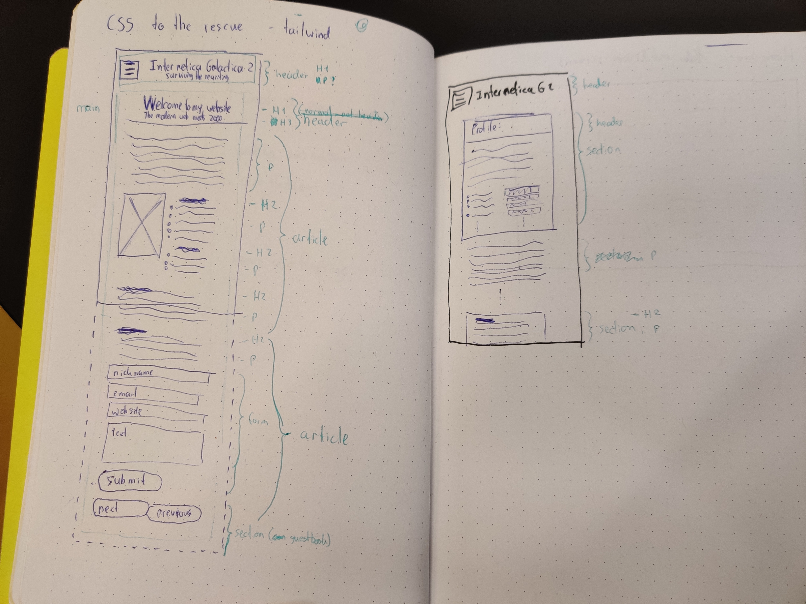
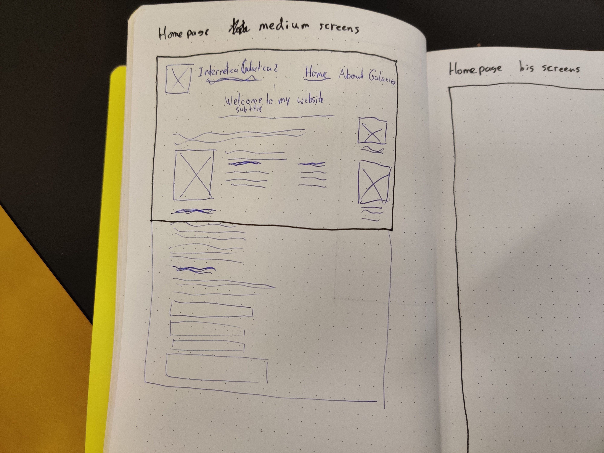
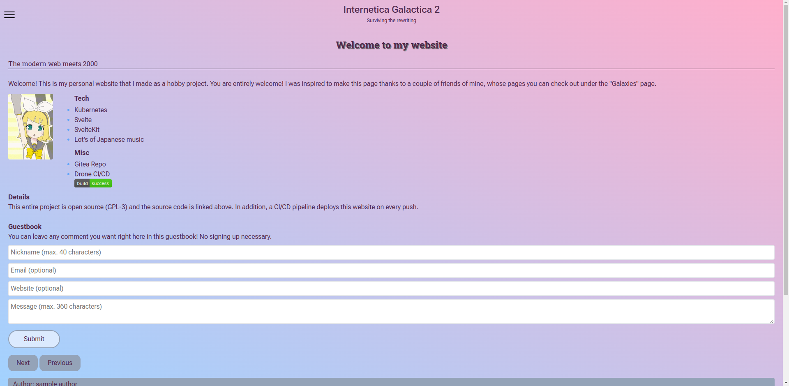
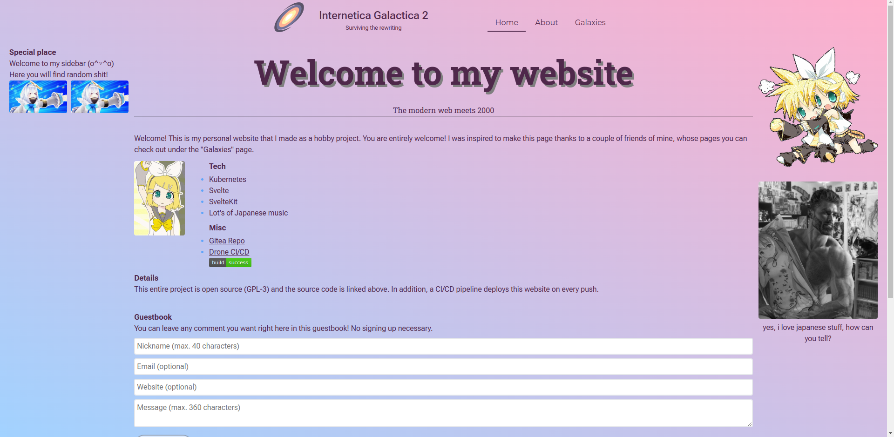
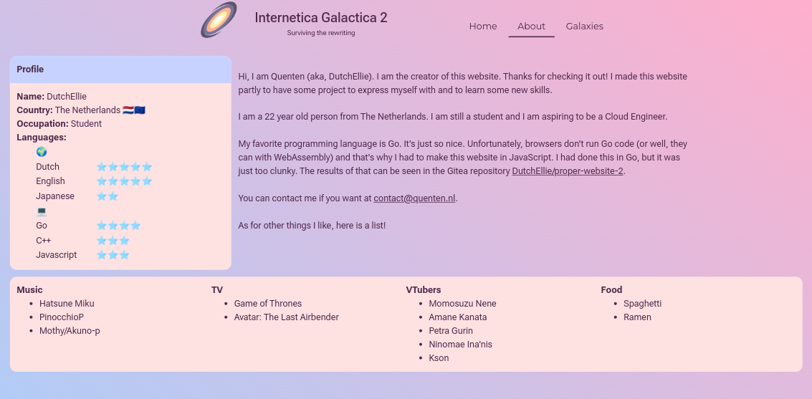
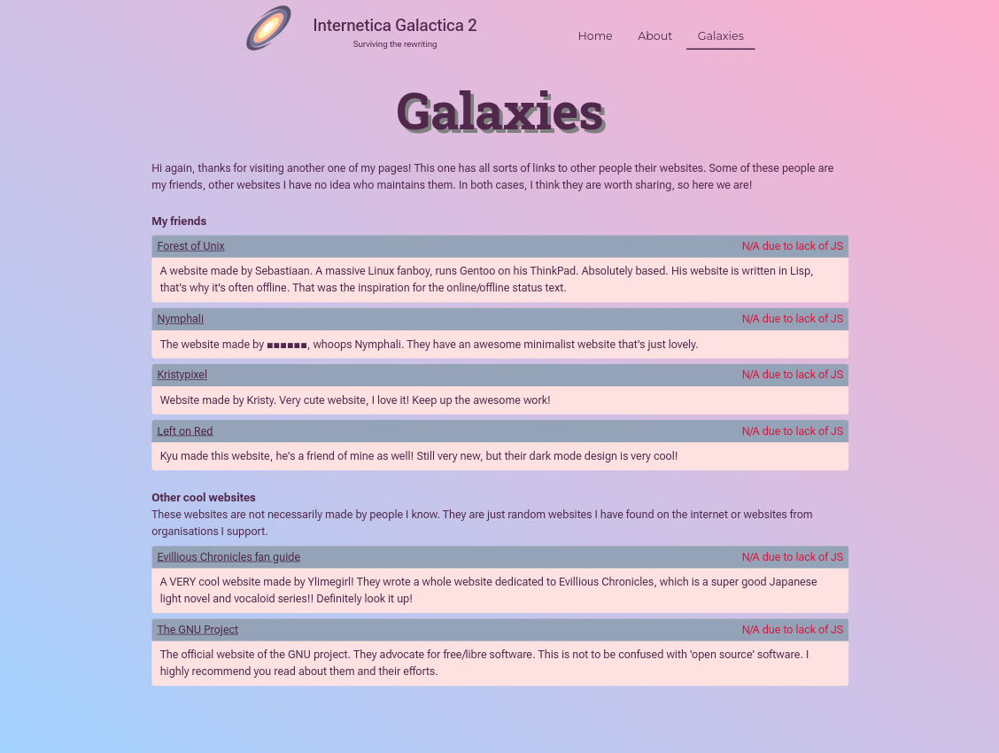
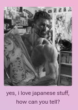
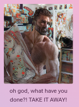

# CSS to the Rescue @cmda-minor-web 2022 - 2023

Hier is de deployment: [Live Github Pages](https://css.quenten.nl)

Dit is het vak CSS to the Rescue van de CMDA Minor Web Design and Development.
Deze repository bevat alle code die ik heb geschreven hiervoor.
Er zijn verschillende branches voor de features die ik heb gemaakt of de gefaalde experimenten.
Deze zijn misschien werkend of niet, maar dat maakt niet uit.

Deze Readme is het verslag van de progressie van de opdracht.

## Opdrachtomschrijving

De opdracht die ik ga aanpakken is [Tailwind zonder Tailwind, met moderne CSS](https://cmda-minor-web.github.io/css-to-the-rescue-2223/index.html#:~:text=4.%C2%A0Tailwind%20zonder%20Tailwind%2C%20met%20moderne%20CSS).
Deze opdracht gaat over het opnieuw maken van een website die je hebt geschreven met behulp van Tailwind.
Hiervoor heb ik [mijn eigen site](https://quenten.nl) gekozen.

De bedoeling van de opdracht is dat er een goed gebruik wordt gemaakt van de features die Tailwind niet gebruikt, zoals cascade, inheritance en @layer.
Ik weet vrij weinig van CSS op het moment dat ik dit schrijf, dus ik kan er weinig van uitleggen.
De essentie is wel dat er een goed gestructureerde CSS uit komt die onderhoudtbaar is, iets dat ik nog nooit heb gedaan.

De catch van de opdracht is dat er **geen** gebruik gemaakt mag worden van CSS classes of ID's.
Ook mag er **geen** JS gebruikt worden.
Verschillende features van de website kunnen dus niet functioneel gemaakt worden, zoals de guestbook of de PWA functionaliteit.
Echter CSS kan blijkbaar veel meer dan ik initieel wist, dus er is voldoende om te leren voldoende dat ik wel kan maken

## Week 1 - Introductie

In deze week heb ik kennis gemaakt met de minor.
Ik heb op vrijdag pas de opdracht gekozen, dus ik heb kon pas toen beginnen met de opdracht.

## Week 2 - Aan het werk

In week 2 ben ik aan het werk gegaan op woensdag.
Ik begon met het maken van schetsen in mijn notitieboek hoe de pagina gestructureerd moet worden.
Daarna heb ik het gemaakt in eerst HTML en daarna CSS.



Voor het medium screen heb ik ook een schets gemaakt.



Ik begon met de homepagina.
Ik heb hier eerst alle HTML geschreven aan de hand van mijn schetsen.
Daarna heb ik de stylesheets gemaakt.
Dit begon met een `style.css` file die alle layers definieert en daarna importeert uit losse CSS files.

Ik heb gekozen voor de volgende volgorde voor de layers:

1. Reset
2. Defaults
3. Components
4. Overrides

Elke layer is zijn eigen css file.
De `style.css` file importeert al deze files en deze wordt dan geimporteerd door de HTML pagina.
Door dit te doen worden de CSS bestanden minder lang en is het dus ietsje overzichtelijker.

### Probleem 1 - Styling tussen pagina's

Nadat ik de eerste `<header>` had gestylet bedacht ik me een probleem.
Ik wilde de CSS selector `main > header` gebruiken om de `<header>` op de hoofdpagina te stijlen en later ook een selector `section > header`.
Dit kan op 1 pagina worden verholpen door het gebruik van `:nth-child` of `:nth-of-type`, **maar dit zou niet meer werken op een tweede pagina**.

Als ik de about pagina zou maken, dan beginnen de tellers weer opnieuw.
Dus nu kan ik niet de stijl op de about pagina anders maken dan de hoofdpagina.

Ik heb hiervoor verschillende workarounds overwogen.

- Maak een tweede CSS stylesheet met overrides per pagina.
  Dit zou betekenen dat ik een extra stylesheet aanmaak.
  Deze zou dan geimporteerd worden door een apart `style.css` stylesheet bestand voor de about pagina.
  De layer waar dit geimporteerd zou worden is dan ergens voor de overrides, maar na de components.
- Gebruik een class / ID in de HTML om een custom element voor de about pagina te stijlen.
  Dit heeft zowel voordelen als nadelen.
  Ik kan wel een class toevoegen aan het custom gestijld blok dat de about pagina moet hebben, echter als je dit toevoegd dan krijg je het probleem dat je dit enkel op dit element kan overriden.
  Er is wel een mooie plek hiervoor, namelijk de `components` layer.
  Dit heeft een beetje mijn voordeel, maar als ik meer dingen wil overschrijven op andere pagina's dan zou ik meer classes moeten gebruiken.
- Plaats een class / ID op de `<html>` of `<body>` tag van de pagina in kwestie.
  Dit kan je dan als selector gebruiken om de elementen daar in te stijlen.
  Dit heeft het voordeel dat je niet voor alle custom blokken een class moet aanmaken, wat mogelijk gezeik kan worden met de opdrachtomschrijving, aangezien je geen klassen mag gebruiken.

Er is ook nog 1 andere optie, maar die is zo erg dat ik die niet eens overweeg.
Ik kan natuurlijk ook op de about pagina de teller resetten door heel veel lege `<header>` elementen toe te voegen.
Dit zou ook werken voor andere objecten.
Dit is alleen zo ontzettend vreselijk, want je moet dan voor elke pagina de nummering perfect in stand houden.
Als je aan 1 pagina iets wilt toevoegen moet je voor alle pagina's alle CSS variabelen veranderen.
Dat is zo'n vreselijk slecht idee dat ik het niet wil doen.

Uiteindelijk kies ik denk ik voor het gebruik van een class op de `<html>` tag van de about pagina.
Daarin maak ik dan styling voor die pagina specifiek.
Dit kan ook werken voor andere pagina's.

#### Update

Na met Sanne te hebben gesproken over dit probleem is het uiteindelijk gebleken dat het gebruik van data attributen op HTML tags handiger is.
Dit voldoet nog steeds volledig aan de opdrachtomschrijving, omdat je geen classes gebruikt.

Ik mag ze echter niet overal gaan gebruiken, zoals wanneer ik een vreselijk lelijke CSS selector krijg zoals `main > article:nth-of-type(2) > section > article > header`.
Dit zou veel mooier kunnen met een `article[data-component="gb-comment"] > header` bijvoorbeeld.
Omdat dit eigenlijk om de opdracht heen werken is mag dit niet, hoewel het wel echt super super veel beter zou zijn.

### Experimenten

Ik heb geprobeert om CSS nesting te gebruiken.
Ik heb bijvoorbeeld de volgende code geschreven:

```css
main > header {
  text-align: center;

  & > h1 {
    font-family: "Roboto Slab";
    font-weight: 700;
    text-shadow: 2px 2px gray;
    transition: text-shadow 0.25s cubic-bezier(0.075, 0.82, 0.165, 1);

    &:hover {
      text-shadow: 5px 5px gray;
    }
  }

  & > h3 {
    font-family: "Roboto Slab";
    font-weight: 400;
    font-size: 1rem;
  }

  /* hr following header */
  & + hr {
    border-color: black;
    border-width: 0px;
    border-top-width: 1px;
  }
}
```

Ik heb hier echter een paar dingen uitgevonden.
Nesting is best wel cool, maar de CSS wordt er niet altijd meer leesbaar van.
Ik vindt het vooral handig voor dingen als `:hover` of andere states, maar voor dingen als items eronder selecteren wordt het vrij onoverzichtelijk.

## Week 3 - Woensdag

Ik heb woensdag gewerkt aan het maken van de about en galaxies pagina van mijn website.
Deze pagina's waren erg snel te maken, met minimale hindernissen.
Dit kwam voornamelijk omdat de CSS erg goed opgemaakt was en dus niet heel veel werk nodig had.
Er waren wel een aantal kleine dingetjes die ik tijdens het maken bedacht die ik toen heb veranderd.
Dit was bijvoorbeeld de CSS voor de `h2`:

```css
main > article h2 {
  font-weight: 700;
  font-size: 1rem;
}
```

Deze CSS is correct, maar onnodig.
Ik had deze CSS net zo goed voor alle `h2` elementen kunnen laten gelden en deze in de `defaults.css` file kunnen plaatsen.

## Week 3 - Donderdag

Ik heb donderdag aan het begin van de dag wat gewerkt aan de layout van de large screen versie van de pagina.

| Broken desktop   | Fixed desktop    |
|--------------- | --------------- |
|  |  |

In de desktop versie worden er aan de homepagina twee sidebars (`<aside>` elementen) toegevoegd.
De content in het midden wordt ook ietsje smaller, anders is het te breed.
Andere kleine fixes zijn dat de hamburger menu wordt vervangen door een navigation bar, de titel wordt vergroot en er is een logo toegevoegd.

De andere pagina's hebben ook een andere layout.
De about pagina laat de grid layout iets meer doen.
Het "skills" block wordt kleiner gemaakt en de tekst die op mobiel eronder staat, komt daar nu aan de rechter kant te staan.



De galaxies pagina is niet erg interessant.
Het is in principe hetzelfde als de homepagina, maar zonder de sidebars.



### Leuke feature met checkboxes

Op de homepagina van de website staat in de rechter sidebar een afbeelding van het meme karakter ["gigachad"](https://knowyourmeme.com/memes/gigachad).

| Normaal | Na klik |
| --- | --- |
|  |  |

Op mijn originele website wordt er geluisterd voor een klik event op de afbeelding en als er wordt geklikt worden de afbeelding en de ondertekst veranderd.
Dit is een easter egg, zeker omdat het niet duidelijk is dat je erop kan klikken.

Om deze functionaliteit na te maken met enkel CSS heb ik een `<input type="checkbox">` gebruikt.
De code ziet er dan zo uit:

```html
<aside>
  <label for="">
    <input type="checkbox" />
  </label>
</aside>
```

```css
main > aside:nth-of-type(2) > label {
  display: block;
  text-align: center;

  margin-top: 2rem;
}

main > aside:nth-of-type(2) > label::after {
  content: 'yes, i love japanese stuff, how can you tell?';
}

main > aside:nth-of-type(2) > label > input[type="checkbox"] {
  appearance: none;
  content: url('/static/images/literallyme.jpg');
  border-radius: 0.25rem;
  max-width: 100%;
}

main > aside:nth-of-type(2) > label > input[type="checkbox"]:focus {
  outline: none;
}

main > aside:nth-of-type(2) > label > input[type="checkbox"]:focus-visible {
  outline: auto;
}

main > aside:nth-of-type(2) > label > input[type="checkbox"]:checked {
  content: url('/static/images/whydidyoudothis.png');
}

main > aside:nth-of-type(2) > label:has(:checked)::after {
  content: 'oh god, what have you done?! TAKE IT AWAY!';
}
```

Het is een beetje veel CSS, maar er moeten ook veel dingen worden gestijlt.
De label krijgt `display: block`, zodat de `text-align: center` werkt, normaal werkt dat niet omdat een label standaard `display: inline` is.
De `::after` op de label wordt gezet op de tekst die er moet staan als er niks is gebeurt.
De input wordt gestijlt en de initiele afbeelding wordt geplaatst.
Daarna krijg je dingen voor de focus states, voor als iemand based is en geen muis heeft.  
Na de focus states krijg je de magie.
De `:checked` checkbox krijgt een nieuwe content en de `:has()` pseudo-class wordt gebruikt om de content van de label te veranderen.
